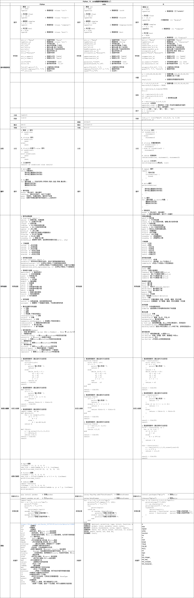

# DataScience_Startup_CheetSheet
Python、R、Julia数据科学入门速查表

这是一个为数据科学初学者设计的极简入门指南，涵盖了Python、R和Julia三种编程语言的基本操作和常用函数。

本项目旨在帮助初学者快速掌握数据科学编程的基础知识。

## 目录

- 基本数据类型
  - 数字
  - 字符串
  - 数组
  - 元组
  - 列表
  - 集合
  - 字典
- 分支
- 循环
- 常用函数
- 自定义函数
- 其他
  - 安装与引入
  - 异常处理
  - 关键字
  
